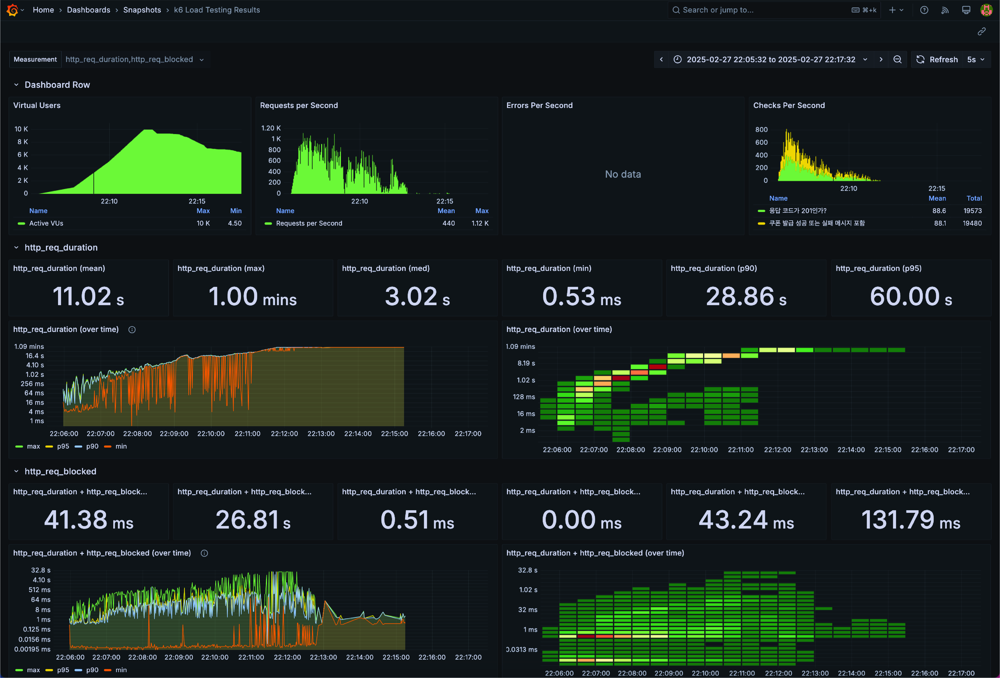

# k6 부하 테스트 보고서

## 1. 개요

이번 부하 테스트는 이커머스 서비스의 선착순 쿠폰 발급 API의 성능과 안정성을 확인하기 위해 진행하였습니다. 대규모 이벤트 상황에서 수많은 사용자들이 동시에 몰리는 경우가 예상되며, 특히 한정 수량 쿠폰 발급과 같은 기능은 이러한 트래픽이 집중되는 대표적인 시나리오에 해당합니다.

로컬 환경에서 진행한 테스트 현 테스트는 실제 서비스 환경과 차이가 있다는 점에서 한계가 있지만 테스트를 실행하는 이유는 다음과 같습니다.

첫째, 기본적인 요청 처리 성능을 확인할 수 있습니다. 둘째, 대규모 트래픽 상황에서 서버 애플리케이션이 병목 현상을 일으키는 지점을 사전에 파악할 수 있습니다. 셋째, 비정상 응답 발생 여부 및 예외 상황 대응 상태를 확인할 수 있습니다. 마지막으로, 응답 시간의 분포 및 특정 구간에서의 임계점을 파악해볼 수 있습니다.

## 2. 테스트 시나리오 및 방법

### 테스트 시나리오

테스트는 점진적으로 동시 접속자 수를 증가시키는 방식으로 진행하였습니다. 1분 간격으로 VU(가상 사용자)를 다음과 같이 조절하였습니다.

- 1분 동안 최대 500명까지 증가
- 1분 동안 최대 1000명까지 증가
- 1분 동안 최대 5000명까지 증가
- 1분 동안 최대 1000명까지 감소
- 1분 동안 부하를 0명까지 감소

### 테스트 대상 API 및 요청 데이터

- 요청 URL: http://localhost:8080/api/v1/coupons/request
- 요청 방식: HTTP POST
- 요청 데이터는 아래와 같이 구성하였습니다.

```jsx
import http from 'k6/http';
import { check, sleep } from 'k6';

export let options = {
    stages: [
        { duration: '1m', target: 500 },   // 1분 동안 500명까지 증가
        { duration: '1m', target: 1000 },  // 1분 동안 1000명까지 증가
        { duration: '1m', target: 5000 },  // 1분 동안 5000명까지 증가
        { duration: '1m', target: 10000 }, // 1분 동안 10000명까지 증가
        { duration: '1m', target: 1000 },  // 1분 동안 1000명까지 감소
        { duration: '1m', target: 0 },     // 1분 동안 부하 감소
    ],
    thresholds: {
        http_req_duration: ['p(95)<1000'], // 95%의 요청이 1000ms 이하
        http_req_failed: ['rate<0.02'],   // 실패율 2% 미만
    }
};

export default function () {
    let userId = Math.floor(Math.random() * 25000) + 1; // 1 ~ 25000 랜덤 유저 ID
    let couponPolicyId = Math.random() < 0.5 ? 1 : 2; // 1 또는 2 중 랜덤 선택

    let res = http.post('http://localhost:8080/api/v1/coupons/request', JSON.stringify({
        userId: userId,
        couponPolicyId: couponPolicyId
    }), {
        headers: { 'Content-Type': 'application/json' }
    });

    let isValid = check(res, {
        '쿠폰 발급 성공': (r) => r.status === 201,
        '예외처리 메세지 반환': (r) => r.status === 400,
    });

    if (!isValid) {
        console.error(`Unexpected status code: ${res.status}`);
    }

    sleep(1);
}

```

- 응답 상태 및 처리 기준
    - 201: 쿠폰 발급 성공으로 간주
    - 400: 예외처리 메세지 반환으로 간주
    - 그 외 상태코드: 예상하지 못한 응답으로 간주하고 별도 로깅

### 테스트 도구 및 환경

- 부하 테스트 도구: k6
- 동시 사용자 수: 최대 5000명
- 목표 응답 시간: 95%의 요청이 1000ms 이내에 응답
- 목표 실패율: 2% 미만
- 결과 저장: InfluxDB 1.8
- 데이터 시각화: Grafana (k6 Load Testing Results 대시보드)

## 3. 테스트 결과 요약



### 주요 성능 지표

- 최대 동시 접속자 수: 약 10000명
- 최대 초당 요청 수(TPS): 약 1120 req/sec
- 평균 응답 시간: 약 11초
- P90 응답 시간: 약 28초
- P95 응답 시간: 약 60초
- 최대 응답 시간: 약 1분

### 문제점 요약

- 동시 사용자 수가 증가함에 따라 응답 시간이 급격히 증가하는 경향을 보였습니다.
- 일부 요청에서는 60초 이상 걸리는 타임아웃 수준의 응답도 다수 확인되었습니다.
- 요청이 처리되지 못하고 대기하는 시간이 길어지는 현상도 관측되었습니다.
- 5000명 이상의 부하에서는 정상 응답률이 급격히 저하되는 문제가 발생하였습니다.

### 상세 지표 분석

| 지표 | 결과 |
| --- | --- |
| 평균 응답 시간 | 약 11초 |
| P90 응답 시간 | 약 28초 |
| P95 응답 시간 | 약 60초 |
| 최대 응답 시간 | 약 1분 |
| 요청 성공률 | 약 88% (실패율 약 12%) |

## 4. 결론 및 개선

### 결론

이번 부하 테스트 결과를 종합하면, 동시 사용자 수가 5000명 수준에서 응답 시간과 실패율이 급격히 증가하는 문제가 확인되었습니다. 특히, Redis 연결 부족, 데이터베이스 쿼리 병목, 분산락 충돌과 같은 병목 가능성이 높아 보였습니다.

다만, 쿠폰 발급이 이미 완료되었거나, 동일 사용자 중복 요청 등의 유효하지 않은 요청에 대해서는 400 응답으로 정상적으로 처리된 점은 긍정적인 부분입니다. 그러나 대규모 트래픽을 안정적으로 처리하기 위해서는  개선이 필요해보입니다.

### 개선을 위해 고려해볼 부분

- Redis 연결 풀 크기 및 Netty 쓰레드 수 증가를 통해 Redis 처리 성능 개선
- 쿠폰 발급 로직에서 불필요한 락 경쟁을 제거하고, Lua 스크립트를 이용한 원자적 처리 방식 도입 검토
- 응답 시간 모니터링 및 타임아웃 설정 점검을 통해 비정상 장기 대기 요청 탐지

## 5. 대시보드 분석

### 응답 시간 변화 추이

부하 초기에는 응답 시간이 비교적 안정적이었으나, 동시 사용자 수 1000명 수준을 넘어가면서 응답 시간이 선형적으로 증가하는 경향을 보였습니다. 이는 서버 내부에서 처리 대기 시간이 길어지는 전형적인 병목 현상으로 분석됩니다.

### 타임아웃 수준 응답 증가

P95 응답 시간이 60초를 기록한 것은 사실상 요청이 타임아웃에 가까운 상태임을 의미합니다. 이는 쿠폰 발급 로직에서 사용 중인 락 경합이나, Redis 및 데이터베이스 연결 풀 부족으로 인해 발생한 것으로 보입니다.

### 요청 처리 한계점

요청 처리 속도(TPS)는 최대 약 1120req/sec 수준에서 정체되는 경향을 보였습니다. 이는 현재 시스템 구성에서 처리 가능한 최대 처리량이 해당 수준이라는 점을 시사합니다. 이를 초과하는 트래픽에서는 요청이 정상적으로 처리되지 못하고 대기 상태로 빠지는 현상이 나타났습니다.

### 테스트 결론

이번 테스트 결과는 로컬 환경에서의 성능 테스트라는 한계가 있지만, 서버 애플리케이션의 구조적 문제나 성능 병목 구간을 발견할 수 있었고 이에 대한 성능 개선 방안을 고려해볼 수 있습니다.